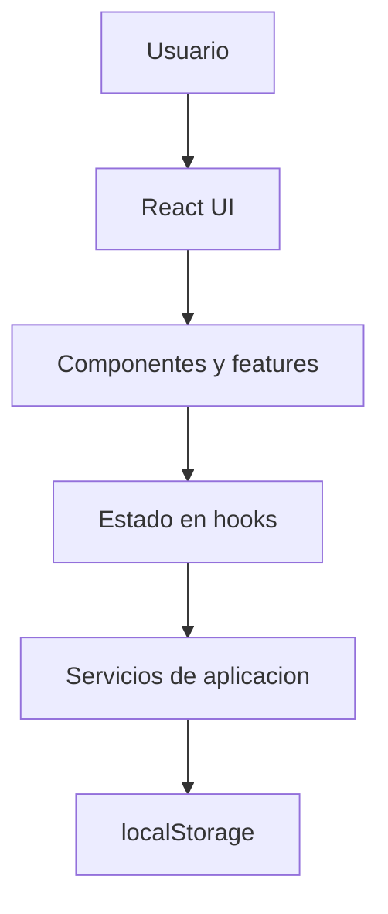

# Gestión de procesos

Aplicacion web local para registrar, consultar y organizar procesos de trabajo que antes se gestionaban en Bloc de notas. Esta pensada para una persona que necesita pegar listas de registros, revisar rapidamente estados, buscar por nombre o identificacion, y conservar copias de seguridad sin depender de servidores externos.

El proyecto es una aplicacion frontend-only: los datos permanecen en el navegador del usuario mediante `localStorage` y pueden exportarse/importarse como archivos JSON.

## Caracteristicas principales

- **Gestion de Procesos**: permite crear, editar, eliminar y listar procesos con fecha, nombre, identificacion, telefono, estado y notas opcionales.
- **Estados visuales**: los procesos pueden estar en `Pendiente`, `Convalidaciones`, `Completo` o `Sin estado`. La UI combina texto, indicador visual y color pastel.
- **Edicion rapida de estado**: cada registro permite cambiar el estado directamente desde la lista.
- **Pegado inteligente**: permite pegar texto proveniente de Bloc de notas, hojas de calculo u otras fuentes, revisar una vista previa e importar registros.
- **Deteccion de duplicados en pegado**: marca posibles duplicados si encuentra la misma identificacion o el mismo telefono con el mismo nombre.
- **Busqueda y filtros de Procesos**: busca por nombre, identificacion o telefono; filtra por estado y fecha.
- **Agrupacion por fecha**: los procesos visibles se muestran agrupados por fecha.
- **Paginacion y scroll interno**: Procesos muestra 10 registros por pagina y Notas muestra 8 por pagina. Las areas de datos tienen scroll independiente para evitar que la pagina crezca indefinidamente.
- **Gestion de Notas**: permite crear, editar, eliminar y buscar notas simples.
- **Importacion/exportacion JSON**: descarga una copia completa de datos e importa copias previas con confirmaciones antes de modificar datos existentes.
- **Persistencia local automatica**: los cambios se guardan en `localStorage` mediante una capa de almacenamiento centralizada.

## Stack tecnologico

Versiones tomadas de `package.json`.

| Tecnologia | Version | Proposito |
| --- | --- | --- |
| React | ^19.3.0 | Interfaz de usuario |
| React DOM | ^19.3.0 | Renderizado de React en navegador |
| TypeScript | ~6.0.2 | Tipado estatico |
| Vite | ^8.3.0 | Desarrollo local y build |
| Tailwind CSS | ^4.3.3 | Estilos de la interfaz |
| @tailwindcss/vite | ^4.3.3 | Integracion de Tailwind con Vite |
| localStorage | API nativa | Persistencia local en el navegador |

No hay backend, base de datos remota, autenticacion ni servicios externos.

## Arquitectura

La aplicacion es monolitica y frontend-only. La informacion fluye desde la UI hacia una unica fuente de datos en React, y luego hacia `localStorage` mediante servicios.



`App.tsx` mantiene la estructura principal y pasa los datos a cada seccion. El hook `useAppData` carga los datos iniciales, guarda cambios automaticamente y expone funciones para reemplazar o limpiar datos.

## Estructura del proyecto

```text
src/
├── App.tsx
├── main.tsx
├── styles.css
├── components/
│   ├── Button.tsx
│   ├── Field.tsx
│   └── Pagination.tsx
├── features/
│   ├── data-management/
│   │   └── DataManagementPage.tsx
│   ├── notes/
│   │   └── NotesPage.tsx
│   └── processes/
│       ├── ProcessesPage.tsx
│       └── services/
│           └── processParser.ts
├── hooks/
│   └── useAppData.ts
├── layouts/
│   └── AppLayout.tsx
├── services/
│   ├── importExport.ts
│   └── storage/
│       └── appStorage.ts
├── types/
│   └── app.ts
└── utils/
    ├── dates.ts
    └── id.ts
```

Carpetas principales:

- `components/`: componentes reutilizables de UI.
- `features/processes/`: pantalla principal de Procesos y parser de datos pegados.
- `features/notes/`: CRUD y busqueda de notas.
- `features/data-management/`: importacion, exportacion y borrado local.
- `services/storage/`: validacion, carga, guardado y preparacion de datos para exportacion.
- `types/`: tipos centrales de la aplicacion.
- `hooks/`: estado global simple de datos.
- `utils/`: utilidades de fechas e IDs.

## Modelo de datos

Los tipos centrales estan en `src/types/app.ts`.

```ts
export type ProcessStatus = 'complete' | 'validation_only' | 'pending' | 'unknown';

export interface Process {
  id: string;
  date: string;
  name: string;
  identification?: string;
  phone?: string;
  status: ProcessStatus;
  originalStatusSymbol?: string;
  notes?: string;
  createdAt: string;
  updatedAt: string;
}
```

Campos importantes de `Process`:

- `id`: identificador unico generado en el navegador.
- `date`: fecha del proceso en formato ISO `YYYY-MM-DD`.
- `name`: nombre de la persona o registro.
- `identification`: identificacion opcional.
- `phone`: telefono opcional.
- `status`: estado normalizado usado por la UI.
- `originalStatusSymbol`: simbolo detectado al pegar datos, si existe.
- `notes`: observaciones opcionales.
- `createdAt` y `updatedAt`: fechas ISO de creacion y modificacion.

```ts
export interface Note {
  id: string;
  title: string;
  content: string;
  createdAt: string;
  updatedAt: string;
}

export interface AppData {
  version: number;
  notes: Note[];
  processes: Process[];
  lastBackupReminderAt?: string;
}
```

`AppData` es la estructura principal guardada en `localStorage`.

## Persistencia local

La persistencia esta encapsulada en `src/services/storage/appStorage.ts`.

- Clave usada en `localStorage`: `procesos-notas-app-data`.
- Los datos se serializan como JSON.
- `loadAppData()` carga y valida los datos al iniciar.
- `saveAppData()` guarda la estructura completa.
- `validateAppData()` valida la forma del JSON antes de aceptarlo.
- `prepareExportData()` agrega `exportedAt` y prepara el JSON exportable.

El hook `useAppData` llama a `loadAppData()` una vez al iniciar y luego guarda automaticamente cada cambio relevante con `saveAppData()`.

Manejo de errores actual:

- Si no hay datos, inicia con notas y procesos vacios.
- Si el JSON local esta corrupto, inicia con datos vacios y muestra un error.
- Si la estructura no es compatible, rechaza los datos.
- Si `localStorage` falla al guardar, informa que el almacenamiento podria estar lleno.

Tambien existe una migracion conservadora para procesos antiguos con estructura flexible (`title` y `fields`), convirtiendolos al modelo actual de `Process`.

### Implicaciones de localStorage

Los datos permanecen en el navegador/dispositivo. No se envian a un servidor y no se sincronizan automaticamente. Si el usuario borra los datos del navegador, cambia de navegador o usa otro dispositivo, podria perder la informacion si no exporto una copia de seguridad.

## Importacion y exportacion

La exportacion se realiza completamente en el navegador desde `src/services/importExport.ts`.

- Archivo generado: `mis-procesos-YYYY-MM-DD.json`.
- Tipo: JSON.
- Contiene version, notas, procesos y `exportedAt`.

Ejemplo simplificado:

```json
{
  "version": 1,
  "exportedAt": "2026-09-14T15:30:00.000Z",
  "notes": [
    {
      "id": "note-1",
      "title": "Recordatorio",
      "content": "Revisar procesos pendientes.",
      "createdAt": "2026-09-14T15:00:00.000Z",
      "updatedAt": "2026-09-14T15:00:00.000Z"
    }
  ],
  "processes": [
    {
      "id": "process-1",
      "date": "2026-09-14",
      "name": "Persona de ejemplo",
      "identification": "123456789",
      "phone": "3000000000",
      "status": "pending",
      "createdAt": "2026-09-14T15:00:00.000Z",
      "updatedAt": "2026-09-14T15:00:00.000Z"
    }
  ]
}
```

La importacion:

- Lee un archivo `.json` seleccionado por el usuario.
- Valida version y estructura.
- Rechaza archivos invalidos.
- Pregunta antes de reemplazar datos.
- Si el usuario no reemplaza, ofrece combinar.
- Al combinar, omite procesos duplicados por identificacion y notas con el mismo `id`.

El borrado de datos locales tambien requiere confirmacion.

## Procesamiento de datos pegados

El parser esta en `src/features/processes/services/processParser.ts`.

Actualmente soporta:

- Fechas en formato `D/M/YYYY`, `DD/MM/YYYY`, `D-M-YYYY` o `DD-MM-YYYY`.
- Separadores de registros por salto de linea.
- Separadores internos por tabulaciones o multiples espacios.
- Lineas separadoras compuestas por guiones.
- Simbolos de estado al final de la linea:
  - `* - *` -> `complete`
  - `-_-` o `- _-` -> `validation_only`
  - `-` -> `pending`
- Palabras o abreviaturas de estado al final de la linea:
  - `ok`, `completo` o `completos` -> `complete`
  - `cv`, `convalidacion` o `convalidaciones` -> `validation_only`
  - `p`, `pendiente` o `pendientes` -> `pending`
- Identificaciones numericas de 6 a 12 digitos.
- Telefonos colombianos simples que empiezan por `3` y tienen 10 digitos.

Casos de uso admitidos:

- `PERSONA COMPLETA  1000000000  3000000000 ok`
- `PERSONA EN VALIDACION  1000000001  3000000001 cv`
- `PERSONA PENDIENTE  1000000002  3000000002 pendientes`
- `PERSONA CON SIMBOLO  1000000003  3000000003 * - *`

Flujo de pegado:

1. El usuario abre `Pegar datos`.
2. Pega el texto.
3. Presiona `Revisar datos`.
4. La aplicacion muestra una vista previa.
5. Se indican advertencias como falta de identificacion, falta de telefono o estado no reconocido.
6. Se marcan posibles duplicados.
7. Al importar, se agregan solamente registros no duplicados.

Limitaciones conocidas del parser:

- Esta optimizado para el formato observado de Bloc de notas y separadores simples.
- No implementa parsing CSV formal.
- No interpreta formatos muy irregulares donde nombre, identificacion y telefono no puedan distinguirse por numeros/separadores.
- No elimina automaticamente duplicados; solo los evita en la importacion desde vista previa si fueron detectados contra datos existentes.

## Busqueda, filtros y paginacion

La aplicacion aplica el flujo correcto antes de renderizar:

```text
Todos los datos
  ↓
Busqueda
  ↓
Filtros
  ↓
Ordenamiento
  ↓
Paginacion
  ↓
UI
```

### Procesos

- Busca en `name`, `identification` y `phone`.
- Filtra por estado: todos, pendientes, convalidaciones y completos.
- Filtra por fecha.
- Ordena por fecha y ultima actualizacion en orden descendente.
- Pagina despues de filtrar.
- Muestra 10 procesos por pagina.
- Agrupa por fecha solo los registros visibles en la pagina actual.
- Al cambiar busqueda, estado o fecha, vuelve automaticamente a la pagina 1.
- Si no hay resultados, muestra un estado vacio con boton para limpiar busqueda/filtros.

### Notas

- Busca en titulo y contenido.
- Ordena por `updatedAt` descendente.
- Muestra 8 notas por pagina.
- Al cambiar la busqueda, vuelve a la pagina 1.
- Si no hay resultados, muestra un estado vacio y permite limpiar la busqueda.

### Scroll interno

Las listas de Procesos y Notas tienen contenedores con `overflow-y-auto` y altura maxima basada en el viewport en escritorio. Esto evita que una gran cantidad de registros haga crecer indefinidamente el layout principal.

## UX y diseno

La interfaz prioriza velocidad y claridad:

- Procesos es la seccion principal.
- Los estados usan color pastel, texto e indicador visual.
- Las acciones frecuentes estan cerca del dato: cambiar estado, editar, eliminar y copiar telefono.
- El pegado de datos tiene una revision previa para prevenir errores.
- Las operaciones destructivas piden confirmacion.
- El header permanece visible con navegacion simple.
- El diseno usa tarjetas limpias, bordes moderados, sombras sutiles y una estetica suave.

## Desarrollo local

Requisitos:

- Node.js y npm instalados.

Instalar dependencias:

```bash
npm install
```

Iniciar servidor de desarrollo:

```bash
npm run dev
```

Crear build de produccion:

```bash
npm run build
```

Previsualizar build:

```bash
npm run preview
```

Scripts disponibles en `package.json`:

| Script | Comando | Proposito |
| --- | --- | --- |
| `dev` | `vite` | Servidor local de desarrollo |
| `build` | `tsc && vite build` | Validacion TypeScript y build de produccion |
| `preview` | `vite preview` | Previsualizacion del build |

No hay variables de entorno configuradas.

## Calidad y validaciones

Herramientas actuales:

- **TypeScript**: valida tipos durante `npm run build`.
- **Vite build**: genera el bundle de produccion.
- **Vitest**: cubre casos de parseo para los datos pegados.

No hay configuracion actual de ESLint ni formatter automatico.

Comando de validacion usado actualmente:

```bash
npm test
npm run build
```

## Seguridad y privacidad

- No existe backend.
- No hay autenticacion.
- No se transmiten datos a servidores externos desde la aplicacion.
- Los datos se almacenan en `localStorage` del navegador.
- La informacion no se sincroniza entre dispositivos.
- Si el usuario borra datos del navegador, podria perder la informacion.
- Se recomienda exportar copias de seguridad periodicamente desde la seccion `Importar / Exportar`.

`localStorage` no debe considerarse almacenamiento seguro para informacion altamente sensible. Es una solucion practica y local para esta etapa del proyecto.

## Limitaciones actuales

- Los datos dependen del navegador y dispositivo donde se usa la app.
- No hay sincronizacion entre dispositivos.
- `localStorage` tiene limites de capacidad y puede fallar si el navegador no permite guardar mas datos.
- El parser de datos pegados esta orientado a formatos simples y puede fallar con entradas extremadamente irregulares.
- No existe importacion CSV formal.
- No hay historial de cambios por registro.
- La cobertura de tests esta enfocada en el parser de procesos; no cubre todavia todos los flujos de UI.
- No hay modo PWA/offline instalable configurado; la app es frontend-only y puede funcionar localmente una vez servida/cargada, pero no tiene service worker.

## Posibles mejoras futuras

Estas ideas no estan implementadas actualmente:

- Usar IndexedDB para manejar mayores volumenes de datos.
- Agregar exportacion CSV.
- Agregar importacion CSV formal.
- Convertir la app en PWA con cache offline mediante service worker.
- Agregar historial de cambios por proceso.
- Mejorar el parser con una revision editable por fila antes de importar.
- Agregar backups automaticos locales descargables.
- Agregar pruebas automatizadas para parser, almacenamiento y flujos principales.
- Agregar filtros adicionales sin sobrecargar la interfaz.

## Filosofia del proyecto

La aplicacion prioriza simplicidad, velocidad y privacidad. Busca reemplazar un flujo manual en Bloc de notas por una herramienta local, clara y rapida, manteniendo el control de los datos en el navegador del usuario y ofreciendo importacion/exportacion para conservar copias de seguridad.
